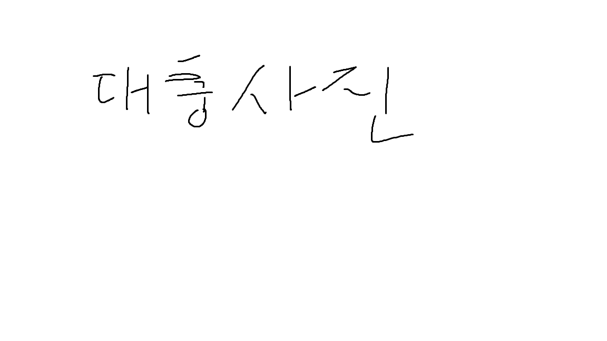

#EarthSandwich 서버

##EarthSandwich/ 지구샌드위치란 :

지구의 서로 반대편에 있는 두 사람이 각각 빵을 땅에 놓는 일종의 장난이다

##들어가며

### 1. 프로젝트 소개

프로젝트를 시작한 이유는 CRUD의 기본이라고 할 수 있는 게시판 기능을 직접 만들어보면서 배우고자 시작하게 되었습니다.
Udemy를 통하여 독학으로 Springframework을 배웠으며 독학후 제작한 기본적인 기능들을 가진 프로젝트입니다.

### 2. 프로젝트 기능

프로젝트의 주요 기능들:

- \*\* 게시판 - CRUD기능, 조휘수, 페이징, 검색처리, 이미지 처리, Geolocation 표시
- \*\* 사용자 - 회원가입 및 OAuth 2.0 구글, 회원정보 수정, 회원탈퇴, 유효성 검사 및 중복 검사
- \*\* 댓글 - CRUD 기능

### 3. 사용 기술

#### 주요 언어 및 프레임워크

- Java 11
- Spring Boot
- Spring Data
- Spring Security
- OAuth 2.0
- Spring Rest

#### Build Tools

- Gradle
- Git
- Github

#### DataBase

- Mysql

#### Cloud

- AWS

#### 프론트앤드

- HTML/CSS
- JavaScript
- BootStrap

## 규모 및 설계

### 1. DB 설계

### DB 설계

### API 설계
