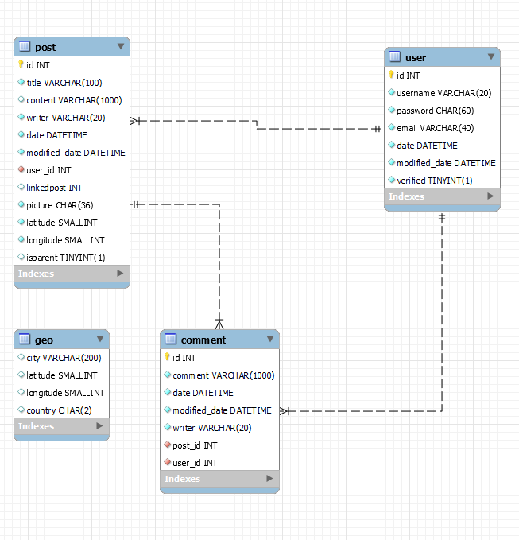
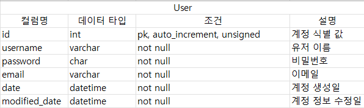
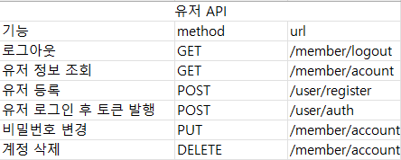
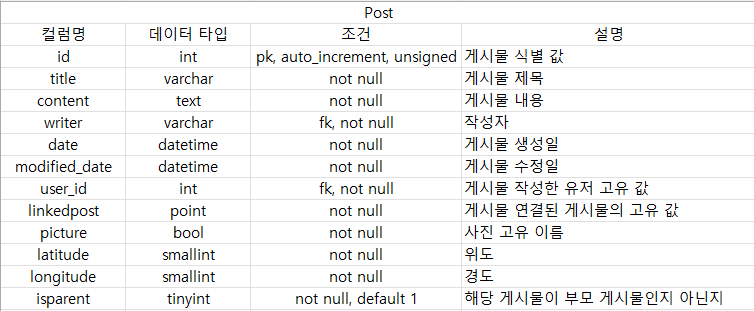
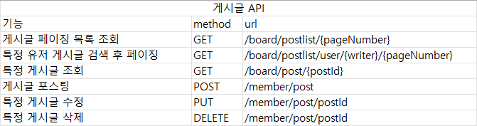
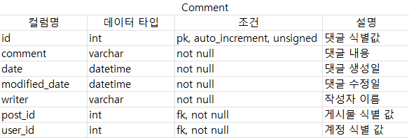
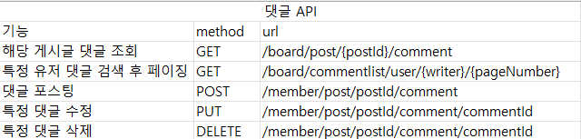
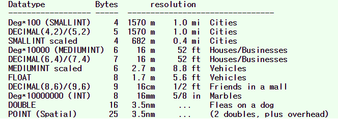
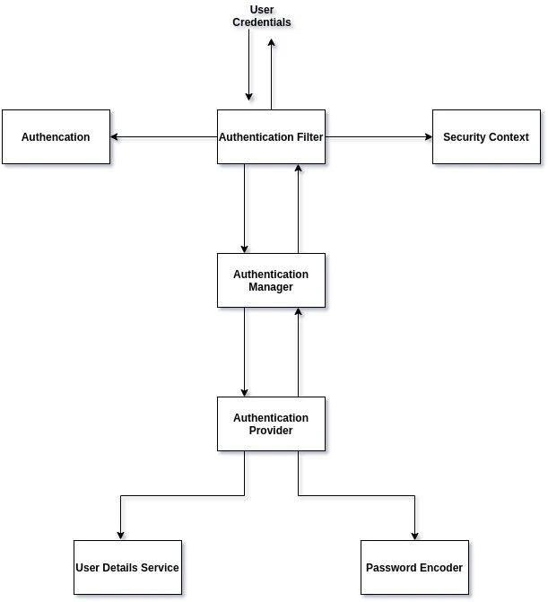

# EarthSandwich 서버

Earthsandwich.lol

## EarthSandwich/ 지구샌드위치란 :

이미지 출저: https://www.reddit.com/r/newzealand/comments/eqaerz/we_made_an_earth_sandwich_bread_on_exact_opposite/

지구의 서로 반대편에 있는 두 사람이 각각 빵을 땅에 놓는 일종의 장난이다

# 들어가며

## 프로젝트 소개

프로젝트를 시작한 이유는 CRUD 응용하여 기본적인 게시판 기능을 직접 만들어보면서 배우고자 시작하게 되었습니다.
Udemy를 통하여 독학으로 Springframework을 배웠으며 독학후 제작한 기본적인 기능들을 가진 프로젝트입니다.

### 개요

- 프로젝트 명칭: earthsandwich
- 개발 인원: 1명
- 개발 기간: 2022.11.15 ~ 2023.01.15
- 개발 언어: java 11
- 간단 소개: 지구 샌드위치를 만들기 위한 웹사이트

### 요구사항 분석

#### 회원가입 페이지

- 유효성 검사
  - 이메일은 형식 패턴 적용
  - 유저 네임은 문자로 시작해야하고 5-12 글자 사이
  - 비밀번호는 최소 8~16자 이상이며, 영문 대 소문자, 숫자, 특수문자를 사용
- 중복확인
  - 존재하는 유저 네임이 있을 경우 "username is already taken" 메시지 보여주기
  - 존재하는 이메일이 있을 경우 "email is already registered" 메시지 보여주기
  - 비밀번호가 조건에 부합하지 않는경우 조건식 메시지 보여주기

#### 로그인 페이지

- 비로그인시 아래 페이지만 이용가능
  - 회원가입
  - 로그인
  - 게시글 목록
  - 게시글 상세보기
  - 특정 유저 게시글 검색
- 로그인 유효성 검사
  - 이메일나 비밀번호가 일치하지 않을 시 "email or password is invalid" 메시지 보여주기
  - 모든 검사 통과후 jwt발급후 index페이지로 이동

#### 회원정보 페이지

- 회원정보 수정은 비밀번호만 가능
- 비밀번호는 최소 8~16자 이상이며, 영문 대 소문자, 숫자, 특수문자를 사용 조건에 부합하지 않는 경우 조건문 메시지 출력

#### 게시글 페이지

- jwt를 가지고 있는 유저만 게시글 작성 가능
- jwt validity 검사
- 특정유저네임 클릭후 해당 유저가 작성한 게시글들 페이징
- 유저가 작성한 글만 수정, 삭제 가능
- 작성한 유저는 내용 글과 제목만 수정 가능 (사진 수정 x)
- 게시글이 link될경우 (지구 샌드위치가 완성될경우) 게시글 삭제 불가

#### 댓글 페이지

- 댓글은 로그인한 (유효한 jwt를 가지고 있는 ) 유저만 가능
- 유저가 작성한 댓글만 수정 및 삭제 가능
- 유저의 계정이 삭제될경우 또는 게시물이 삭제될경우 댓글도 같이 삭제

### 프로젝트 기능

프로젝트의 주요 기능들:

- \*\* 게시판 - CRUD기능, 페이징, 이미지 처리, Geolocation 표시
- \*\* 사용자 - 회원가입 , 회원정보 수정, 회원탈퇴, 유효성 검사 및 중복 검사
- \*\* 댓글 - CRUD 기능

### 사용 기술

#### 주요 언어 및 프레임워크

- Java 11
- Spring Boot
- Spring Data/Hibernate
- Spring Security
- Spring Rest
- Jsonwebtoken

#### Build Tools

- Gradle
- Git
- Github
- Docker

#### DataBase

- Mysql

#### Cloud

- AWS API & BackBlaze B2 (AWS API를 사용 할 수 있는 cloud platform 입니다)

#### 프론트앤드

- HTML/CSS
- React
- React-Router-Dom
- Leaflet
- JavaScript
- BootStrap

# 규모 및 설계

## DB 설계

\
\

\
\

\
\

# ETC

## 추가해야할 기능들

- ~~비밀번호 리셋 이메일 전송 및 email valification 기능~~
- Oauth2.0을 이용한 구글 로그인
- UI 좀 더 다듬기
- ~~JUnit Test 공부하고 적용하기~~

## 어려웠던 점들

### 빈번했던 db 설계 변경

예시 : post의 좌표의 데이터 타입은 원래 mysql의 [spartial extension](https://dev.mysql.com/doc/refman/8.0/en/spatial-type-overview.html)의 point였습니다. 제가 잘못된 spartial type을 써서 (org.springframework.data.geo.Point는 mysql point mapping 되지를 않습니다.) 오류로 고생하고 있을때 해결책을 모색하던 와중 아래 테이블을 발견하게 되었습니다.

해당 테이블을 보고 point가 차지하는 용량에 깜짝 놀랐고요 precision의 경우도 double을 썻을때와 똑같다는 거를 깨달아서 내가 point를 써야 할 이유가 있나 라는 의문점이 들었습니다. 그리고 본질적인 질문은 내가 개발하고 있는 웹사이트가 엄청나게 정밀한 좌표를 요구하나? 라는 의문이 들었습니다.

또 하나의 예시는 foreign key constraint입니다. 저는 얼핏 현업에서는 foreign key가 잘쓰이지 않는다는것을 들은적이 있었는데요. 왜 안쓰이지라는 질문이 저절로 들었습니다. 저는 foreign key는 data integrity와 명확한 table relation을 위해서 필수라고 생각하고 있었거든요. 막상 실제로 orm을 스프링에서 적용해 보면서 update 나 delete를 할때 foreign key constraint에 걸린적이 한두번이 아니였습니다. DB를 설계할때 많은 고려를 해야 한다는것을 깨달았던 프로젝트였습니다.

### Spring Security 적용

전반적인 spring security를 적용하는데 꽤 오랜시간이 걸렸었습니다. 이는 DI에 대한 명확한 개념과 security flow에 대한 지식이 부족했어서 그랬던거 같습니다.

위 그림과 같이 해당 security flow를 명확히 이해하고 코드를 작성해야 했지만 구글에 떠도는 완성된 코드들을 따라치는데 급급했었습니다. 또한 spring security에 한정에서 오래된 코드들이 많았고 현재 spring security와 호환되지 않는 코드들 또한 (심지어 공식 spring 웹사이트에서도) 많았습니다.

### JWT 적용

전반적인 spring security에 대한 지식이 부족하니 authentication filter에 대한 지식 또한 부족하여서 적용하는데 어려움이 많았었습니다.
